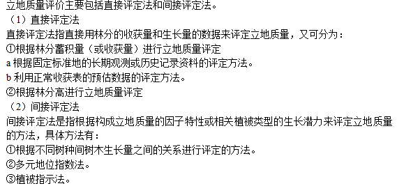

### 1. 什么叫郁闭度?
指林冠投影面积与林地面积之比，用小数十分法表示。

### 2. 简述无人机航拍技术在森林资源病虫害监测及防治中的应用。
可以在无人机身上安装特殊的光谱分析仪，无人机在飞行过程中接受到森林传送回来的光谱后，还能快速进行分析，这样可以很快诊断出植物病虫害各类，同时可携带药物对患病植株进行现场施药。

### 3 简述激光雷达监测树高的基本原理。 
激光雷达是向目标（森林）发射探测信号(激光束)，然后将接收到的从目标反射回来的信号(目标回波)与发射信号进行比较，作适当处理后,就可获得目标的有关信息，如目标距离、方位、高度、速度、姿态、甚至形状等参数。激光雷达利用多次回波技术，获取森林结构的三维信息，估计森林的树高等垂直参数。

### 4 遥感技术是什么？
是指不接触物体而探测物体有关信息的技术。遥感的基本原理：通过分析传感器采集到的某一时间、某一区域内的平均电磁波辐射水平数值，按其值大小与变化规律来有效地识别地物。

### 5 什么是小班
是指林班内林学特征、立地条件一致，相同的经营目的和经营措施的单位。小班是森林经营的最小单位，也是森林调查规划设计的基本单位。

### 6 森林资源调查有哪些？
全国森林资源清查：简称一类清查。其调查目的是为掌握全国和省（区、市）森林资源现状与消长变化动态，宏观分析森林资源变化与发展趋势，为制定全国林业方针政策，编制和调整各种林业规划、计划，开展森林资源监测，预测森林资源发展趋势提供科学决策依据。调查周期为每5年1次。 森林资源规划设计调查（简称二类调查）。

森林资源规划设计调查(简称二类调查)是以国有林业局(场)、自然保护区、森林公园等森林经营单位或县级行政区域为调查单位，以满足森林经营方案、总体设计、林业区划与规划设计需要而进行的森林资源调查。调查单位是小班。调查周期为10年1次。

森林资源作业设计调查简称三类调查，是以某一特定范围或作业地段为单位进行的作业性调查，一般采用实测或抽样调查方法，对每个作业地段的森林资源、立地条件及更新状况等进行详细调查，目的是满足林业基层生产单位安排具体生产作业（如主伐、抚育伐、更新造林等）需要而进行的一种调查，一般在生产作业开展的前一年进行。其调查成果直接服务于调查目的，例如：林业上常见的伐区作业设计调查、造林作业设计调查等。

### 7 简述森林资源信息编码的规则。森林资源信息编码时为什么要有可扩展性？  
森林资源信息编码的规则：唯一性,简单性,可扩展性,规范性,适用性。

森林资源信息的代码结构必须能适应同类编码对象不断增加的需要，必须对新的编码对象留有足够的备用码，以适应不断扩充的需要。

### 8 森林资源蓄积量估测中为什么通常要求解自变量因子隶属度和归一化
自变量因子信息虽然都以数值的形式进行表示，但存在以下几个问题：  
(1) 除少数几个指标（如土层厚度、A层厚度等）外，其它指标数据在更大程度上都还只是具有字符的含义，数值越高并非意味着对森林资源生长就具有越大的促进或者拟制作用；    
(2) 许多自变量因子数值分类过细、跨度太大的问题也将影响到后续的训练速度和预测效果；   
(3) 不同指标取值范围差别很大，需将它们统一到同一量纲。如，海拔值、坡度值、坡向值等等均如此。   

### 9 基于BP神经网络的森林资源蓄积量的建模型和估测通常要经过哪些步骤?
确定训练及仿真样本集  
设置BP神经网络模型参数  
建立网络  
训练网络  
网络仿真  
森林资源蓄积量仿真结果分析  

### 10 简要叙述从数字高程模型（DEM）中可以产生哪些数据
拔(Elevation)  
坡度(Slope)  
坡向（Aspect）  
地表曲率（Curvature）  
太阳辐射（Solar）  
地形湿度指数（TWI）  

### 11 森林资源信息管理中为什么要有多源数据集成？请举例说明。
一种数据源常常只能较好地反映森林资源被测对象的某一方面。DEM可提取高程、坡度、坡向等数据；遥感数据能较好区分各种地类及林分特征；GPS能较好确定某一目标的经、纬度；实地测量能够得到树高、胸径等多种因子，但因地势、成本和效益等原因必须通过其它数据源加以补充。  
森林资源多源数据提供的信息具有冗余性、互补性和协作性。进行多源数据融合与建模是一项十分有意义的工作，将可以更好地利用不同的数据源，获取被测目标更准确、更综合、更有效的信息。

### 12 请绘出决策支持系统的基本框架图，并辅以文字说明其操作原理。

### 13 简述立地质量评价的主要方法。

### 14 什么叫GPS
GPS是英文Global Positioning System（全球定位系统）的简称。GPS是20世纪70年代由美国陆海空三军联合研制的新一代空间卫星导航定位系统 。其主要目的是为陆、海、空三大领域提供实时、 全天候和全球性的导航服务，并用于情报收集、核爆监测和应急通讯等一些军事目的，经过20余年的研究实验，耗资300亿美元，到1994年3月，全球覆盖率高达98%的24颗GPS卫星星座己布设完成。 

### 15 如果要你设计一款林业野外作业的信息采集设备，那你设计时将包含哪些功能模块？谈谈每个模块的作用。
 
比如但不局限以下部分和解释：  
采集模块：传感器等信息采集  
定位模块：GPS等定位  
传输模块：USB等信息外联传输的  
交互模块：显示屏等  
驱动模块：用于驱动设备的  
电源模块：供电  
通信模块：GPRS、4G等信息传输  
存储模块：信息存储用  
处理器：是核心，设备的CPU
 

 ### 16 yy
   
   

 ### 17 dq
  
  

### 18 fh
  
  

### 19 什么叫胸径
胸高直径的简称。我国和大多数国家胸高位置定为地面以上1.3米高处。
 
### 20 什么叫智慧林业
是指充分利用云计算、物联网、大数据、移动互联网等新一代信息技术，通过感知化、物联化、智能化的手段，形成林业立体感知、管理协同高效、生态价值凸显、服务内外一体的林业发展新模式……（自由回答）  

### 21 大数据？？

是指无法在一定时间范围内用常规软件工具进行捕捉、管理和处理的数据集合，是需要新处理模式才能具有更强的决策力、洞察发现力和流程优化能力的海量、高增长率和多样化的信息资产。

### 22 森林资源的特点
（1）森林资源的可再生性和再生的长期性；  
（2）森林资源功能的不可替代性；  
（3）森林资源产品转化的巨差性；  
（4）森林资源具有多种功能，可以提供多种物质和服务。  

 ### 23 请简要叙述遥感在森林资源动态监测中的应用。
森林资源动态监测中的常采用多源遥感技术，结合摄影遥感和微波遥感、多光谱(或高光谱）遥感与高空间分辨率遥感、光谱信息与纹理信息融合等遥感和信息处理技术，实现森林资源的识别与分类。

### 24 这是一个传统森林资源调查的图片，请你仔细考虑并回答以下问题。  
（1）传统管理的弊端  
投入大量的人力;花费巨额的资金;浪费海量的纸张。    
（2）传统管理的衍生问题  
时间分辨率低;各科室部门业务数据各自为营，无法共享;错误查找困难，纠纷不断;资料保管难度大，查询效率低

